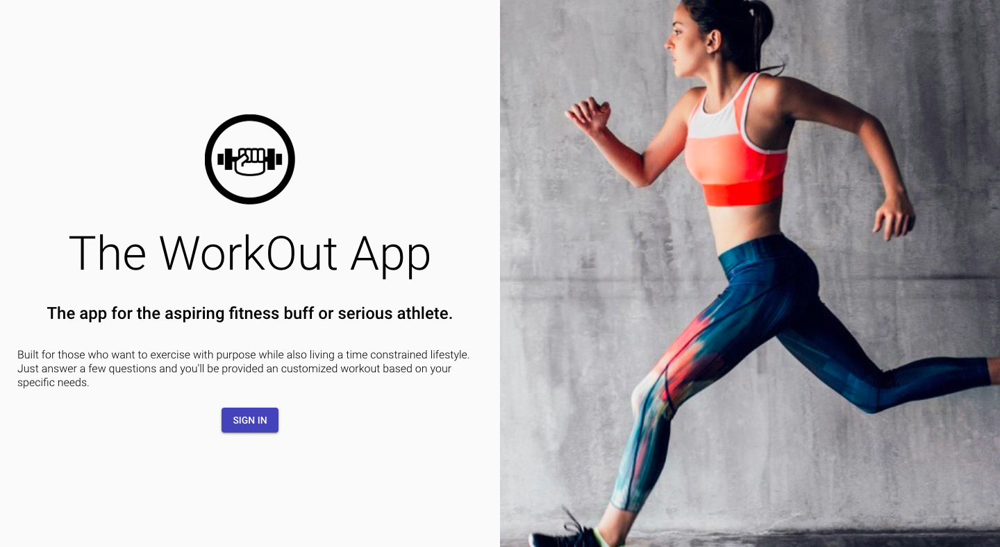
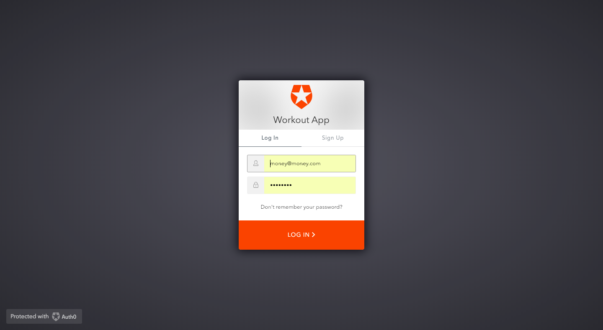
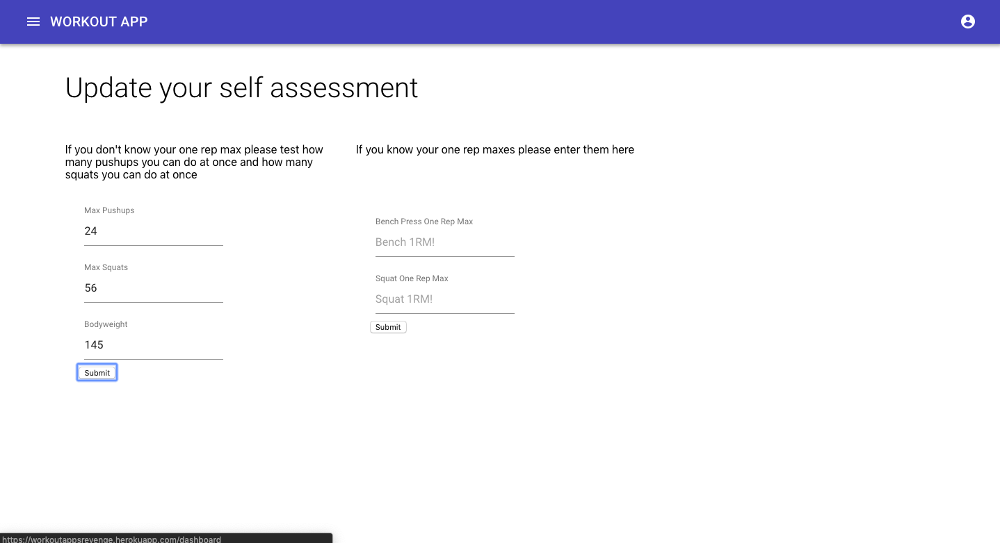
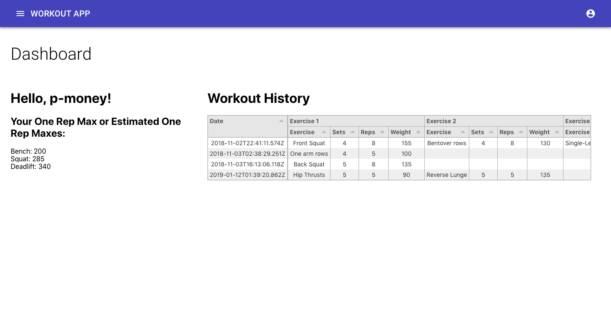
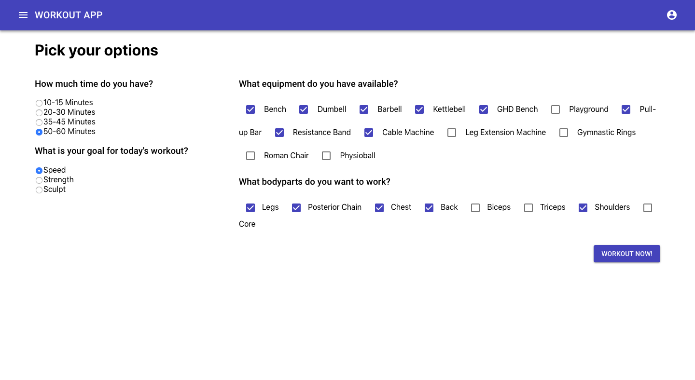
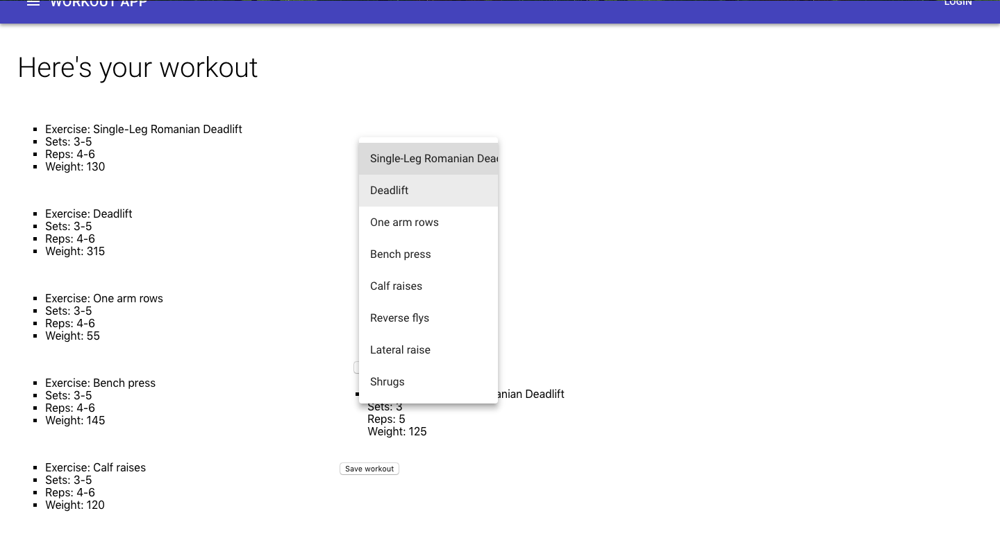
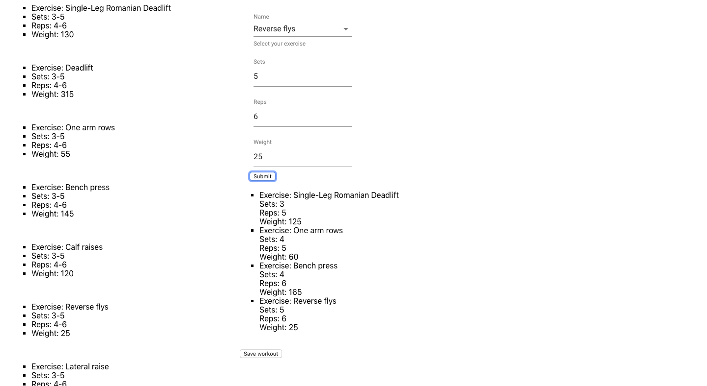
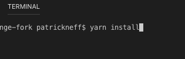
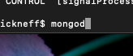
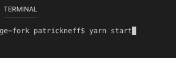

# Workout App

#### This is a web applicaiton designed to provide a strength and conditioning workout based on a users preferences. 

#### After signing up or logging in the user has the option to input their one rep max for bench press and squat. 

#### If the user does not know their one rep maxes they can take a max rep test requiring no equipment. After inputing the test values as well as their bodyweight the application will provide estimated one rep maxes for bench press, squat, and deadlift. 

#### These values will be used later to recommend weights for each exercise. 

#### When the user is ready to workout they can choose their purpose (strength, speed, sculpt), length of their workout, what body parts they'd like to target, and what equipment they have available to them.

#### From there a workout complete with sets, reps, and weight is given to the user. After each exercise is the completed the user can input what they did and each workout is saved under their profile.

# Getting Started:
Since this is a MERN stack application you will need the correct technologies on your local machine.

## Prerequisites:
* MongoDB
* Express
* React
* NodeJS 

## Installation:
In command line- 'yarn install'

## To Run the Application and Test:
* Set up a database server by typing 'mongod' in terminal

* In a separate terminal shell type 'yarn start' to run the application

# Deployment:
We deployed this using Heroku in combination with mLab for database management

# Built With:
* React.JS
* Material-UI
* Auth0 
* Node.JS
* MongoDB/Mongoose
* Express
* Lodash
* Passport

# Contributing: 
Contact one of the authors directly if interested in contributing :)

# Authors: 
* Patrick Neff - Concept, back-end routing and data managment, some UX/UI
* Robert Smithson - Concept, authorization, UX/UI
* Mark Ishaug - Concept, UX/UI

# Acknowledgements:
* Lee Vorthman originally gave me the base idea for this app which I and the other group members took and ran with
* Andy Miller for strength and conditioning tips
